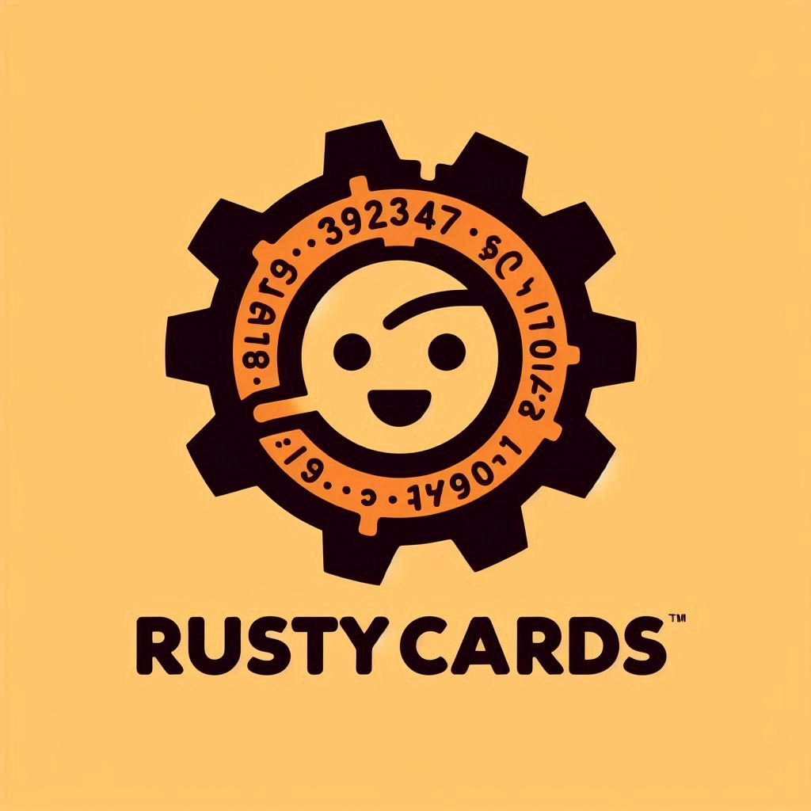
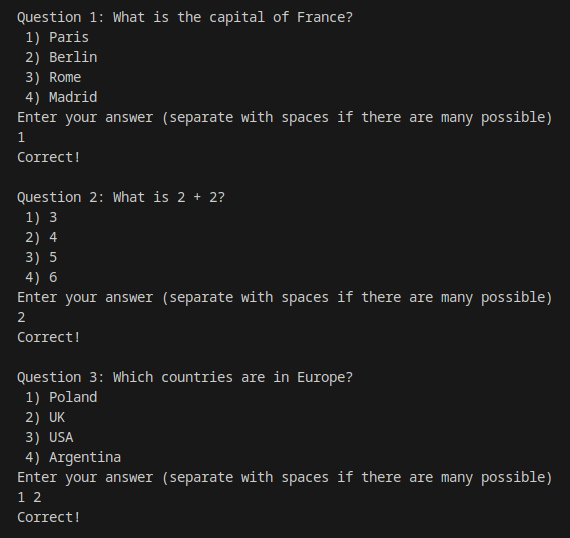

# RustyCards
**RustyCards** is a small terminal app for creating custom quizzes using JSON files.


  
## Features:
- Create your own JSON file with custom questions.
- Shuffle questions for randomness.
- Track points for each quiz session.
- Multiple answer questions.

### Prepare for any exam with...  
**RUSTY CARDS!**



## Installation
```cargo install rusty_cards```  
(as simple as that!)

## How to Use:
1. Create a JSON file with your quiz questions.
2. Run the app and provide the path to your JSON file. Also use ```-s``` flag if you prefer RustyCards to shuffle questions for you!  
```rusty cards -f <your path to json file> -s```  
3. Answer questions and get your score at the end!

## Example JSON file
```json
[
  {
    "question": "What is the capital of France?",
    "options": ["Paris", "Berlin", "Rome", "Madrid"],
    "answer": "1"
  },
  {
    "question": "What is 2 + 2?",
    "options": ["3", "4", "5", "6"],
    "answer": "2"
  }
]
```
